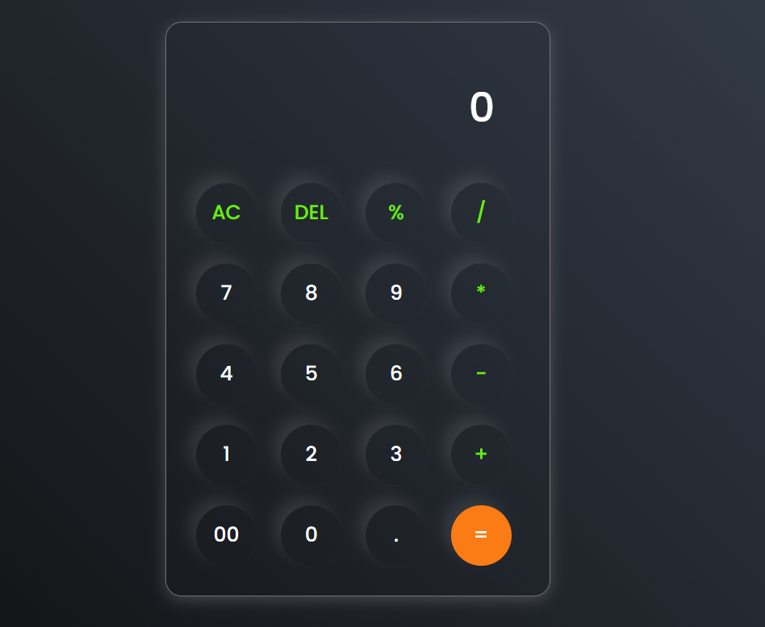

# Calculator App 🧮

A simple, responsive calculator built using **HTML**, **CSS**, and **JavaScript**. It performs basic arithmetic operations like addition, subtraction, multiplication, and division.

---

## 🔧 Features

- Basic arithmetic operations: `+`, `-`, `*`, `/`, `%`
- Clear (`AC`) and Delete (`DEL`) buttons
- Responsive design – works on desktop and mobile
- Built with pure **vanilla JavaScript**, no libraries used

---

## 📸 Screenshot

 

---

## 🚀 Live Demo

[Click here to see it live](https://nitesh-kumar864.github.io/simple-calculator/)

---

## 🛠️ Tech Stack

- HTML5
- CSS3
- JavaScript 

---

---

## 🙋‍♂️ Author

- **Nitesh Kumar**
- GitHub: https://github.com/nitesh-kumar864

